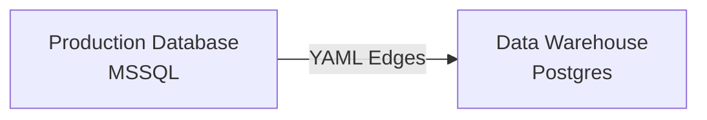

## Roblox Reference Implementation

Welcome to the Roblox reference implementation of Grai.

The best way to get support is to join us on [Slack](https://join.slack.com/t/graicommunity/shared_invite/zt-1il70kfeb-TaCm5fwHg_quWCpKNYyj6w).

## Grai Cloud

We have setup a workspace on Grai cloud, so you can get started straight away, at https://app.grai.io. If you need additional user credentials, just let us know.

## Setup

The implementation demonstrates our GitHub action integration. When a pull request is opened, Grai checks to see if any production database changes will impact your downstream data flows. If there are any test failures, Grai comments on the pull request, so that you can fix any issues before merging to production, without needing to switch to another tool.

The demo uses a Microsoft SQL Server as a production database (see below for credentials) and Postgres to simulate a downstream data warehouse. We have used a [yaml file](https://github.com/grai-io/roblox-demo/blob/master/files/edges.yaml) to construct the link between the production database and data warehouse, this represents the ETL process typically done with a tool such as Fivetran or Stitch. This git repository mainly consists of a dbt project, which is used to transform the data in the data warehouse and includes a number of data quality tests, which Grai has automatically read in. The dbt manifest file is available [here](https://github.com/grai-io/roblox-demo/blob/master/files/manifest.json).

## Operating Guide

- Make a change to one of the SQL files [here](https://github.com/grai-io/roblox-demo/tree/master/dev-database)
- Commit to a branch and open a pull request
- The Github action will compare the dev database changes to the existing data lineage graph
- The Github action will comment on the pull request if any tests fail, a link will take you through to the full report on Grai cloud

## Next Steps

You can find a step-by-step guide for setting up your own environment on Grai cloud [on our docs site](https://docs.grai.io/examples/enhanced-dbt), based on using Snowflake and Postgres, however it could easily be adapted to work with other data stores.

## Database credentials

Here are the credentials for the databases:

### MSSQL

| Field    | Value                                                          |
| -------- | -------------------------------------------------------------- |
| Host     | sample-mssql-database.cudyk77thtpt.us-west-2.rds.amazonaws.com |
| Port     | 1433                                                           |
| Database | roblox                                                         |
| User     | roblox                                                         |
| Password | KXRqnH1gO$33GvD&                                               |

> Note needs additional_connection_strings=["TrustServerCertificate=yes"] when using the python sdk

### Postgres

| Field    | Value                                                    |
| -------- | -------------------------------------------------------- |
| Host     | sample-database.cudyk77thtpt.us-west-2.rds.amazonaws.com |
| Port     | 5432                                                     |
| Database | roblox_demo                                              |
| User     | roblox_demo                                              |
| Password | KdkgMEYK0g%8w#X#                                         |
